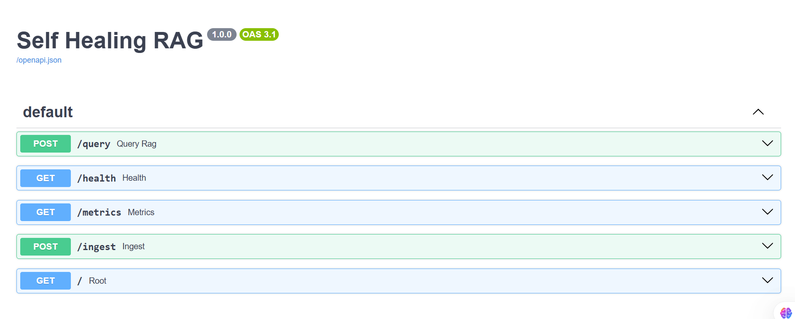
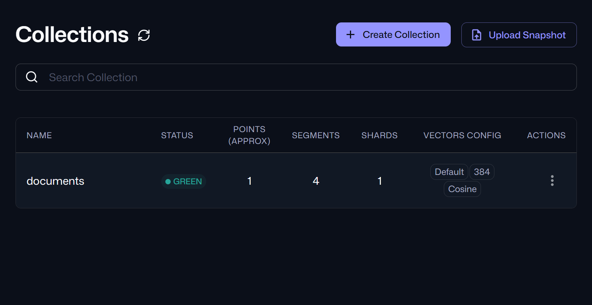
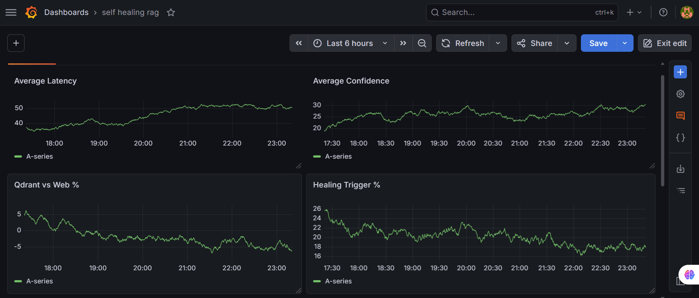

<div align="center">

<br/>

```
╔═══════════════════════════════════════════════════════════╗
║                                                           ║
║          S E L F - H E A L I N G   R A G                 ║
║                                                           ║
║     Production-Grade RAG with Autonomous Recovery         ║
║                                                           ║
╚═══════════════════════════════════════════════════════════╝
```

**Traditional RAG fails silently. This one fixes itself.**

<br/>

[](https://python.org)
[](https://fastapi.tiangolo.com)
[](https://qdrant.tech)
[](https://docker.com)
[](https://kubernetes.io)
[](https://grafana.com)
[](https://postgresql.org)

<br/>

</div>

---

## The Problem With RAG

Every RAG system you've seen has the same flaw:

> Query goes in → Retrieval happens → Answer comes out.

No one checks if the retrieval was actually good. No one verifies the answer isn't hallucinated. When it fails, it fails silently — returning confident-sounding nonsense.

**This project fixes that.**

---

## What Makes This Different

This isn't a chatbot wrapper or a basic document QA tool. It's a **self-healing retrieval pipeline** — one that monitors itself, detects its own failures, and recovers autonomously.

```
       STANDARD RAG                     SELF-HEALING RAG
       ────────────                     ────────────────

  Query → Retrieve → Answer          Query → Retrieve → Score
                                                           │
                ✗ No feedback                    Low quality?
                ✗ Silent failures                    │
                ✗ Hallucinations               Rewrite query
                                                    │
                                             Retry retrieval
                                                    │
                                           Generate answer
                                                    │
                                       Hallucination check
                                                    │
                                        Failed? Regenerate
                                                    │
                                            Final answer ✓
```

---

## System Architecture

```
                            ┌──────────────────┐
                            │    User Query     │
                            └────────┬─────────┘
                                     │
                    ┌────────────────▼─────────────────┐
                    │         Query Expansion Layer      │
                    │  ┌─────────┐ ┌─────┐ ┌────────┐  │
                    │  │MultiQry │ │HyDE │ │Decomp. │  │
                    │  └─────────┘ └─────┘ └────────┘  │
                    └────────────────┬─────────────────┘
                                     │
                    ┌────────────────▼─────────────────┐
                    │      Hybrid Retrieval Engine       │
                    │         Dense  +  BM25             │
                    └────────────────┬─────────────────┘
                                     │
                    ┌────────────────▼─────────────────┐
                    │      Reciprocal Rank Fusion        │
                    └────────────────┬─────────────────┘
                                     │
                    ┌────────────────▼─────────────────┐
                    │       Cross-Encoder Reranker       │
                    └────────┬────────────────┬────────┘
                             │                │
                        High Quality     Low Quality
                             │                │
                             │    ┌───────────▼──────────┐
                             │    │   Query Rewrite Agent  │
                             │    │   → Retry Retrieval    │
                             │    └───────────┬──────────┘
                             │                │
                    ┌────────▼────────────────▼────────┐
                    │         Answer Generator           │
                    └────────────────┬─────────────────┘
                                     │
                    ┌────────────────▼─────────────────┐
                    │      Hallucination Detection       │
                    │         NLI Cross-Encoder          │
                    └────────┬────────────────┬────────┘
                             │                │
                        Faithful         Hallucinated
                             │                │
                             │    ┌───────────▼──────────┐
                             │    │  Grounded Regeneration │
                             │    │  Remove → Regen → Check│
                             │    └───────────┬──────────┘
                             │                │
                    ┌────────▼────────────────▼────────┐
                    │           Final Response           │
                    │  { answer, confidence, sources }   │
                    └──────────────────────────────────┘
                                     │
              ┌──────────────────────┼──────────────────────┐
              │                      │                       │
     PostgreSQL Metrics       Grafana Dashboard       Tavily Fallback
```

---

## Ingestion Pipeline

```
  Documents (PDF / URLs / Files)
              │
              ▼
        Chunking Layer
    (512 tokens / 64 overlap)
              │
              ▼
    BAAI/bge-small-en-v1.5
       Embedding Model
              │
              ▼
    ┌─────────────────────┐
    │   Qdrant Collection  │
    │  documents [GREEN ●] │
    │  Vectors: 384-dim    │
    │  Similarity: Cosine  │
    └─────────────────────┘
```

Each chunk is stored with structured metadata:

```json
{
  "source": "document.pdf",
  "chunk_index": 12,
  "timestamp": "2026-06-16",
  "doc_hash": "sha256_abc123..."
}
```

---

## Self-Healing: Step by Step

| Step | What Happens | Technology |
|------|-------------|------------|
| **1. Retrieve** | Hybrid dense + BM25 search across Qdrant | Qdrant + BM25 |
| **2. Score** | Cross-encoder evaluates relevance of retrieved chunks | MS-MARCO Cross Encoder |
| **3. Rewrite** (if needed) | Query rewrite agent generates better queries | LLM Agent |
| **4. Retry** | Expanded search with rewritten queries | Hybrid Retrieval |
| **5. Generate** | Answer produced from top-k reranked context | Ollama / OpenAI |
| **6. Verify** | NLI model checks if every claim is grounded in sources | NLI Cross Encoder |
| **7. Regenerate** (if needed) | Unsupported claims removed, answer rebuilt | Grounded Regen |
| **8. Fallback** | If retries fail, web search kicks in | Tavily API |

---

## Technology Stack

| Layer | Technology | Purpose |
|-------|-----------|---------|
| **API** | FastAPI | REST endpoints, async handling |
| **Vector DB** | Qdrant | Dense vector storage + ANN search |
| **Embeddings** | BAAI/bge-small-en-v1.5 (384-dim) | Document and query encoding |
| **Retrieval** | Dense + BM25 hybrid | Best-of-both retrieval |
| **Fusion** | Reciprocal Rank Fusion | Multi-strategy result merging |
| **Reranker** | MS-MARCO Cross Encoder | Relevance scoring |
| **Hallucination** | NLI Cross Encoder | Faithfulness verification |
| **Cache** | Redis | Query result caching |
| **Metrics DB** | PostgreSQL | Request/performance logging |
| **Monitoring** | Grafana | Real-time dashboards |
| **Container** | Docker + Docker Compose | Service orchestration |
| **Orchestration** | Kubernetes | Production deployment |
| **Web Fallback** | Tavily | Out-of-index search |
| **LLM Backend** | Ollama / OpenAI-compatible | Answer generation |

---

## API Reference

### `POST /query`

```http
POST /query
Content-Type: application/json

{
  "query": "What is Retrieval Augmented Generation?"
}
```

```json
{
  "answer": "Retrieval Augmented Generation is...",
  "sources": ["doc1.txt", "doc2.txt"],
  "confidence": 0.91,
  "healing_triggered": false
}
```

When the system is unsure and self-healing exhausts retries:

```json
{
  "status": "low_confidence",
  "confidence": 0.42,
  "sources": ["doc3.txt"],
  "healing_triggered": true
}
```

### `POST /ingest`

Upload documents into the Qdrant vector store with automatic chunking and embedding.

### `GET /health`

Service health check — confirms API, Qdrant, Redis, and PostgreSQL connectivity.

### `GET /metrics`

Returns aggregate statistics: healing rate, average confidence, latency percentiles, cache hit ratio.

---

## Performance Metrics

Every request is persisted to PostgreSQL and visualized in Grafana:

```json
{
  "query": "What is...",
  "confidence": 0.89,
  "healing_triggered": true,
  "retrieval_latency_ms": 82,
  "generation_latency_ms": 421,
  "total_latency_ms": 503,
  "sources_used": 3,
  "rewrite_count": 1
}
```

### Grafana Dashboards

| Panel | Tracks |
|-------|--------|
| **Average Latency** | End-to-end response time trend |
| **Average Confidence** | Retrieval quality over time |
| **Healing Trigger %** | How often self-healing activates |
| **Qdrant vs Web %** | Vector retrieval vs Tavily fallback split |

---

## Screenshots

### Swagger API — Live Endpoint Documentation



---

### Qdrant Collections — Vector Store with 384-dim Cosine Embeddings



---

### Grafana Dashboard — Real-Time Observability



---

## Running Locally

```bash
# Clone
git clone <repository-url>
cd self-healing-rag

# Set up environment
python -m venv venv
source venv/bin/activate          # Linux/Mac
# venv\Scripts\activate           # Windows

# Install dependencies
pip install -r requirements.txt

# Start Qdrant, Redis, PostgreSQL, Grafana
docker compose up -d

# Launch API
uvicorn app.main:app --reload
```

> API live at `http://localhost:8000` · Docs at `http://localhost:8000/docs` · Grafana at `http://localhost:3000`

---

## Kubernetes Deployment

```bash
kubectl apply -f k8s/
```

Spins up:
- FastAPI deployment with configurable replicas
- LoadBalancer service
- Qdrant StatefulSet
- PostgreSQL + Redis deployments
- Grafana with pre-loaded dashboards

---

## What This Project Demonstrates

This isn't a tutorial project or a chatbot demo. It's a **production AI platform** that required genuine architectural decisions:

- **Retrieval engineering** — hybrid search, RRF fusion, cross-encoder reranking, parent-child chunking
- **Agentic recovery loops** — query rewriting agents, confidence-gated retry logic
- **Hallucination mitigation** — NLI-based faithfulness verification before any answer is returned
- **MLOps discipline** — structured logging, PostgreSQL metrics, Grafana observability, Redis caching
- **Production deployment** — Dockerized microservices, Kubernetes manifests, health checks

---

## Roadmap

- [ ] Agentic retrieval planning (dynamic strategy selection)
- [ ] Knowledge graph integration for structured reasoning
- [ ] Multi-modal RAG (images, tables, charts)
- [ ] Streaming responses
- [ ] Distributed Qdrant clusters
- [ ] Automated RAGAS benchmarking CI
- [ ] LangSmith production tracing
- [ ] Multi-tenant support

---

## Author

**Dhwani Jain**
*ML Engineer · Data Engineer · AI Systems Builder*

Building production-grade AI platforms, retrieval systems, MLOps pipelines, and intelligent search architectures.

---

<div align="center">

*If this project was useful to you, a ⭐ goes a long way.*

</div>
